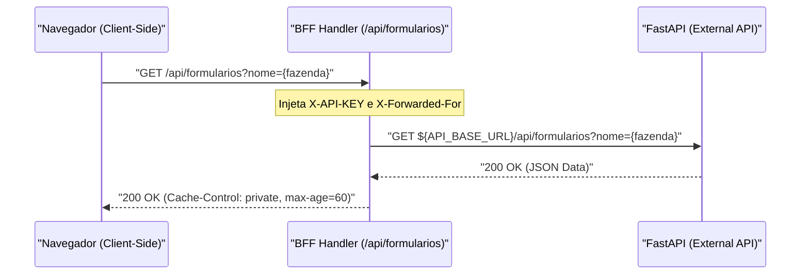

# 📂 Directory Documentation: `src/app/api/formularios`

## 🎯 Overview
* **Purpose:** Prover um endpoint de Proxy BFF seguro (Backend-For-Frontend) para mediação de chamadas de leitura das opções de formulário e dados detalhados de fazendas cadastradas, injetando chaves de autenticação do lado do servidor (`X-API-KEY`) e protegendo segredos de infraestrutura.
* **Layer:** Backend-For-Frontend (BFF) / API Route Layer (Next.js App Router).

## 🏗️ Architecture and Data Flow

## 🗂️ Component Mapping
* `📄 route.ts`: Endpoint GET HTTP do Next.js App Router responsável por validar variáveis de ambiente, construir a URL de destino com encodamento de parâmetros, repassar headers de rastreamento de IP e aplicar cabeçalho de cache HTTP.

## 🧠 Design Decisions & Trade-offs
* **Decision:** Injeção do cabeçalho `X-API-KEY` no servidor Next.js durante a passagem do proxy.
* **Motivation:** Prevenir o vazamento da chave de API secreta para o código cliente no navegador.
* **Trade-off:** Pequeno overhead de latência de repasse (< 5ms) compensado pela segurança total da credencial.

## 🧪 Testing Strategy
* **Test Types:** Integration & Unit testing via Jest (`tests/api/formularios.spec.ts`).
* **Critical Scenarios:** Validação da injeção do token, tratamento de query params `nome`, e graceful failure (500) quando `API_BASE_URL` ou `API_TOKEN` estiverem ausentes.

## 🔗 Related Context
* Obsidian Vault: `[[sdd-promover-rota-formularios-frontend]]`
