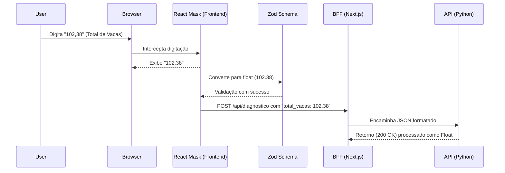

# 📁 Módulo de Coleta e Ajuste de Dados (`src/app/formulario` & `src/app/ajustes`)

---

## 🎯 Visão Geral (The Blueprint)

Este módulo centraliza a lógica de interface com o usuário para a coleta primária (Formulário) e a reavaliação (Ajustes) de indicadores zootécnicos e econômicos da fazenda. A principal responsabilidade deste módulo é garantir a integridade dos dados na borda da aplicação (Frontend), validando limites de negócio estritos e provendo uma experiência à prova de erros de tipagem através de máscaras numéricas universais, que convertem entradas baseadas na localidade (vírgulas e pontos) em estruturas computacionais seguras (floats) antes da submissão ao Backend For Frontend (BFF).

---

## 🏗️ Arquitetura e Fluxo de Dados

A arquitetura garante que a conversão dos dados pelo usuário aconteça sob demanda na UI via `react-number-format` e passe por uma camada robusta de validação formal (Zod) antes do tráfego de rede.

* **Entrada:** Interação direta do produtor nos campos de formulário (via Browser).
* **Saída:** Payload tipado submetido à API de diagnóstico e estado global atualizado (via Zustand).

**Reference Note:** [[Site_Ishikawa_Educampo_2026-07-06_float-inputs-mask]]

---

## 🗂️ Mapeamento de Componentes

### 📄 Arquivos Chave

#### `📄 src/app/formulario/page.tsx`

* **Responsabilidade:** Renderização do formulário principal de diagnóstico inicial. Captura todos os dados baseados na UX de "primeiro acesso" e inicializa os cálculos no BFF.
* **Principais Funções/Classes:**
    * `InputComDica`: Componente extraído que injeta automaticamente máscaras customizáveis (`NumericFormat`) e exibe hints baseados na constante de `CASAS_DECIMAIS` (3).
    * `handleSubmit`: Dispara a verificação Zod de todos os bindings com tratamento de erro `fail-fast` via toast messages e injeta dados na store Zustand caso válidos.
* **Dependências Críticas:** Depende amplamente do `useFazendaStore` para injeção global e do `react-number-format`.

#### `📄 src/app/ajustes/page.tsx`

* **Responsabilidade:** Atua como ferramenta iterativa do diagnóstico já processado. Permite correções e "What-If" scenarios recarregando a API do diagnóstico sem limpar os dados.
* **Principais Funções/Classes:**
    * `CampoNumericoAjuste`: Componente otimizado que unifica os bindings de `NumericFormat` com os labels (`LabelComDica`), implementando o princípio DRY.
    * `handleSubmit`: Aplica mecanismo de "cooldown" (proteção anti-spam) limitando requisições à API para uma a cada 30 segundos.

#### `📄 src/lib/schemas.ts`

* **Responsabilidade:** Define os contratos inquebráveis e limites tolerados para as variáveis.
* **Principais Funções/Classes:**
    * `fazendaSchema`: Schema `z.object` aplicando limites estritos (e.g. `FAZENDA_LIMITS`) e validações cruzadas. As validações numéricas confiam no `z.coerce.number()` permitindo floats sem quebra de pipeline.

---

## 🧠 Decisões de Design & Trade-offs

* **Decisão:** Extrair a formatação decimal diretamente para os inputs na UI (`NumericFormat`) ao invés de usar parsers customizados no evento nativo.
* **Motivo:** O uso da biblioteca nativa `react-number-format` resolve implicitamente problemas de Regex complexos (ex: múltiplos pontos, localidade `pt-BR` vs `en-US`, não-numéricos) sem invenção de roda.
* **Trade-off / Débito Técnico:** A dependência obriga o mapeamento e cast refinados para as props herdadas (`React.ComponentProps<typeof NumericFormat>`), adicionando uma ligeira complexidade na tipagem do componente genérico.

---

## 🧪 Estratégia de Testes

* **Tipo de Teste dominante:** Testes Unitários de Comportamento via `Jest`.
* **Cenários Críticos:** A suíte `tests/schemas/float-inputs.spec.ts` foca estritamente na validação dos dados após a coleta da máscara, garantindo que a "linha de defesa final" do sistema processe Floats perfeitos, aceite coercões de strings (Ponto) e previna entradas ilegais. Testes de Performance validam carga pesada.
* **Estratégia de Mocking:** O payload (`basePayload`) atua de fixture base injetada nos parses customizados.

